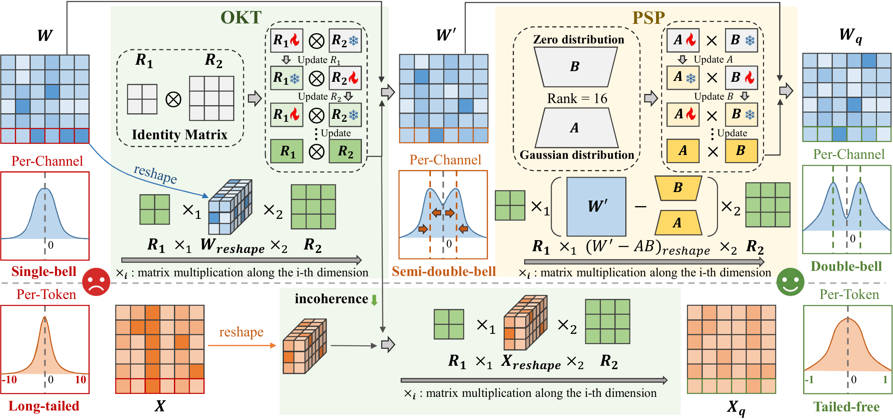
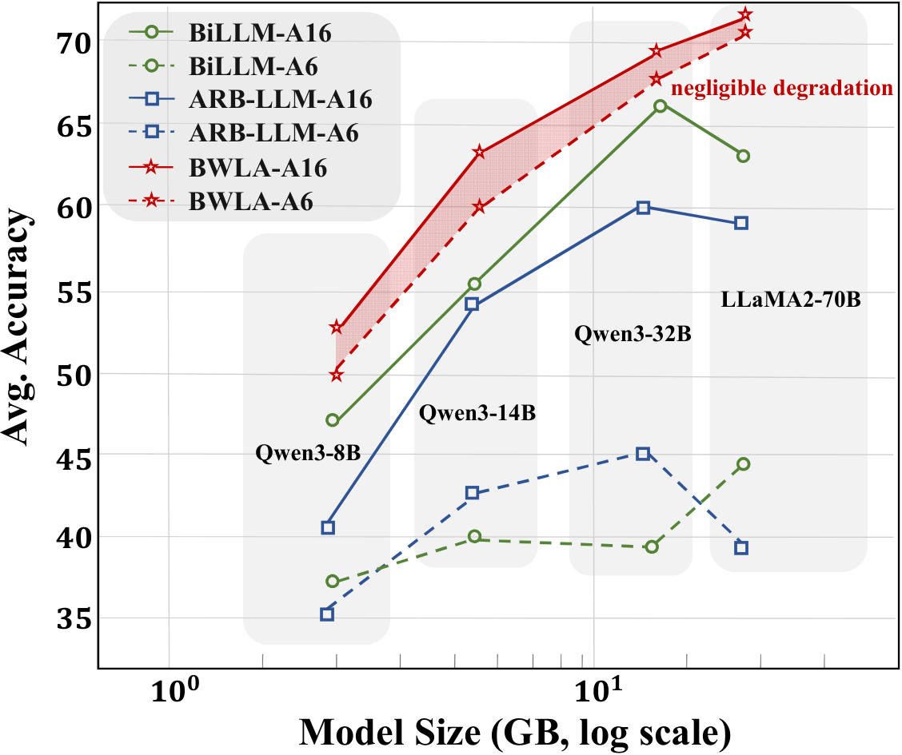
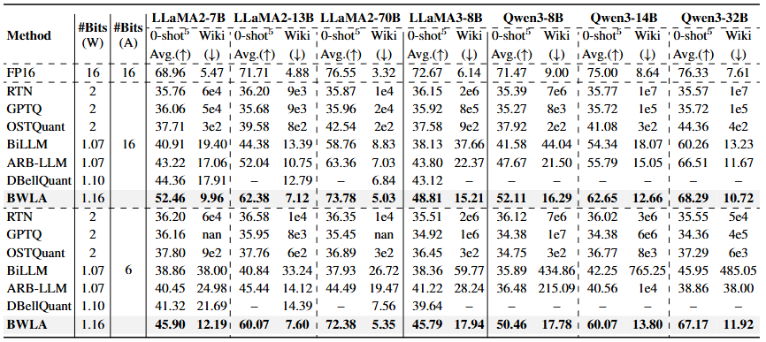

# [ACL'26] BWLA: Breaking the Barrier of W1AX Post-Training Quantization for LLMs

[Zhixiong Zhao](https://kishon-zzx.github.io/)*, Zukang Xu, and Dawei Yang

---

> **Abstract:** Large language models (LLMs) have driven major progress in NLP, yet their substantial memory and compute demands still hinder practical deployment. Binarization can compress weights to 1 bit, fundamentally lowering compute and bandwidth cost. However, existing methods cannot address activation heavy tails and thus must keep activations in high precision, preventing true end-to-end acceleration. To overcome this limitation, we propose **BWLA** (**B**inarized **W**eights and **L**ow-bit **A**ctivations), the first post-training quantization framework that preserves high accuracy while achieving 1-bit weight quantization together with low-bit activations (e.g., 6 bits). The Orthogonal-Kronecker Transformation (OKT) learns an orthogonal mapping via EM minimization, converting unimodal weights into symmetric bimodal forms while suppressing activation tails and incoherence. The Proximal SVD Projection (PSP) then performs lightweight low-rank refinement through proximal SVD projection, further enhancing quantizability with minimal overhead. On Qwen3-32B, BWLA reaches a Wikitext2 perplexity of 11.92 under 6-bit activations (vs. 38 from SOTA), improves five zero-shot tasks by more than 70\%, and delivers 3.26× inference speedup, demonstrating strong potential for real-world LLM compression and acceleration. The code will be available at https://github.com/Kishon-zzx/BWLA.



Figure 1 in the main paper demonstrates that our proposed BWLA outperforms the previous state-of-the-art binary PTQ method, ARB-LLM, across all scales of the LLMs. Furthermore, BWLA remains robust under both weight-only and weight–activation quantization, while other methods degrade sharply with activation quantization.

<p align="center">
  
</p>


## 🔎 Results
<details>
<summary>BWLA achieves superior perplexity performance on WikiText2 datasets and superior average accuracy on 5 zero-shot QA datasets. (click to expand)</summary>

<p align="center">
  
</p>

</details>

## Citation

If you find the code helpful in your research or work, please cite the following paper.

```

```